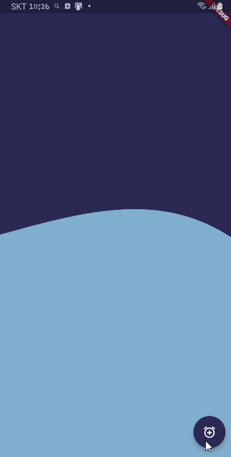
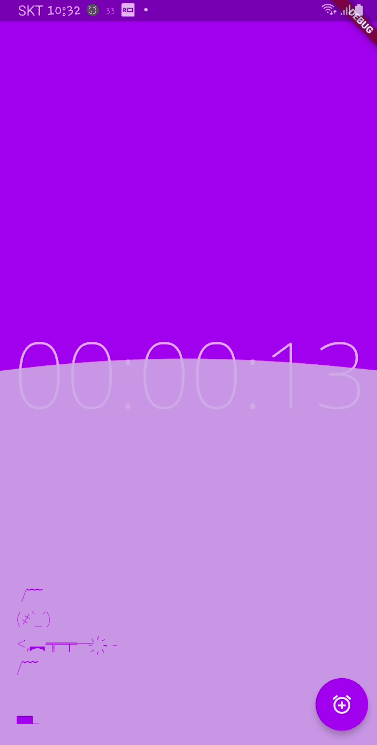
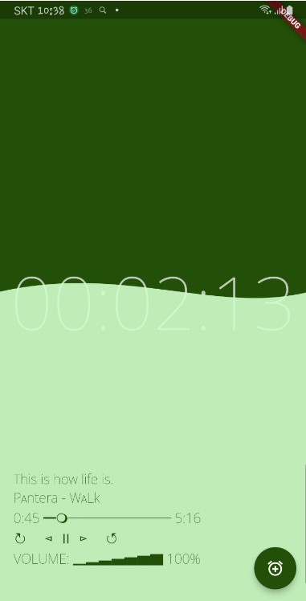
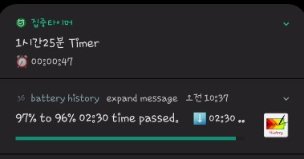

# 플러터 명상타이머
> Flutter로 만드는 명상타이머 prototype

Android에 특화된 소스. Android의경우, Service를 foreground로 실행하지 않으면 핸드폰에서 배터리 절약을 위해 어느순간 종료시킴. 그래서 Timer의 기능을 flutter_foreground_task를 사용하여 구현함. 

##### 사용된 플러그인

~~~

  wakelock: ^0.6.2                 // 화면실행시 종료방지
  flutter_foreground_task: ^3.8.1  // Flutter의 Foreground 서비스(카운터 구현)
  animated_text_kit: ^4.2.2        // 애니메이션 텍스트처리 
  hive: ^2.0.5                     // 데이터 로딩/저장
  hive_flutter: ^1.1.0             //
  intl: ^0.17.0                    // 시간포멧

~~~

pub.dev 사이트링크(설치 및 도움말)

- [wakelock](https://pub.dev/packages/wakelock)
- [flutter_foreground_task](https://pub.dev/packages/flutter_foreground_task)
- [hive](https://pub.dev/packages/hive)
- [intl](https://pub.dev/packages/intl)

#### 참고된 stackoverflow

- [물결처리효과](https://github.com/bilalidrees/Flutter_Water_Animation?ref=flutterawesome.com)
- [timeline](https://stackoverflow.com/questions/49635381/flutter-create-a-timeline-ui)

#### 화면

|   |   |
|:---:|:---:|
|   |   |
|   |   |
|   |   |
